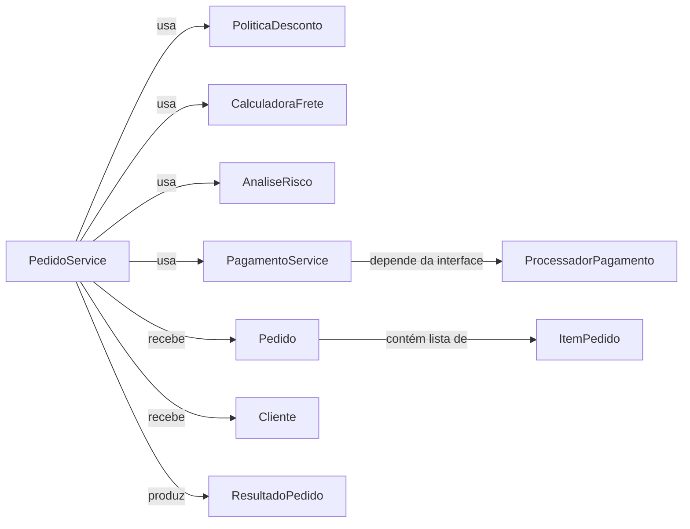
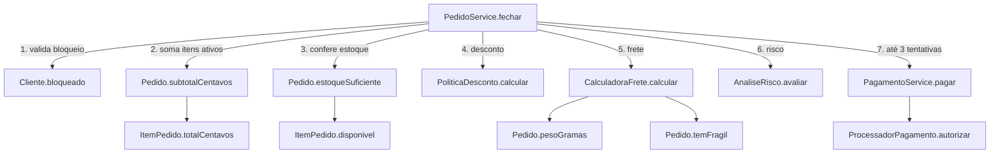
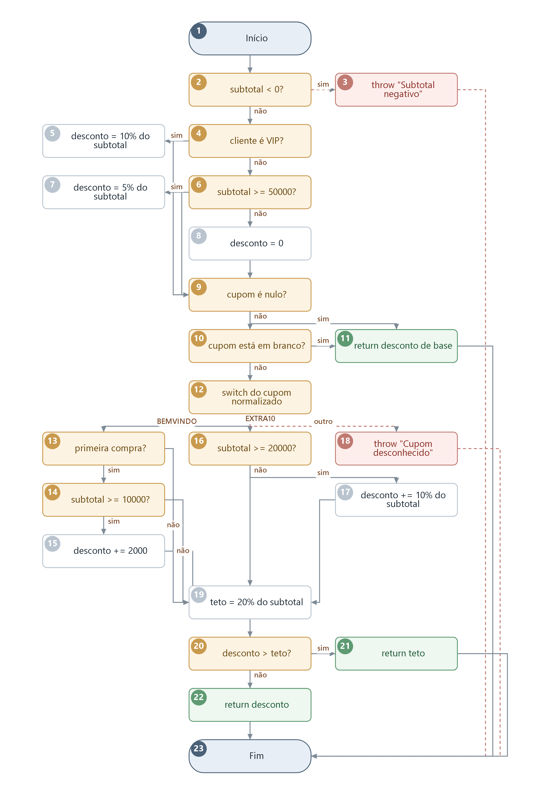
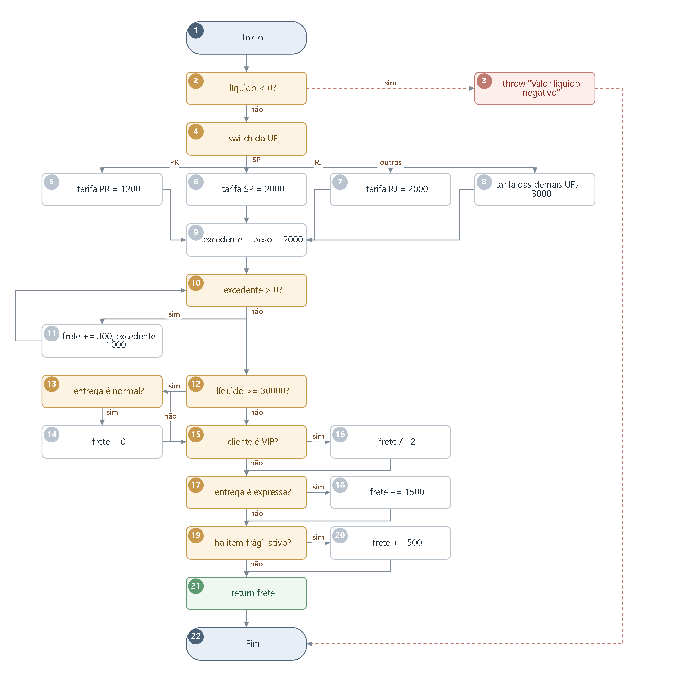
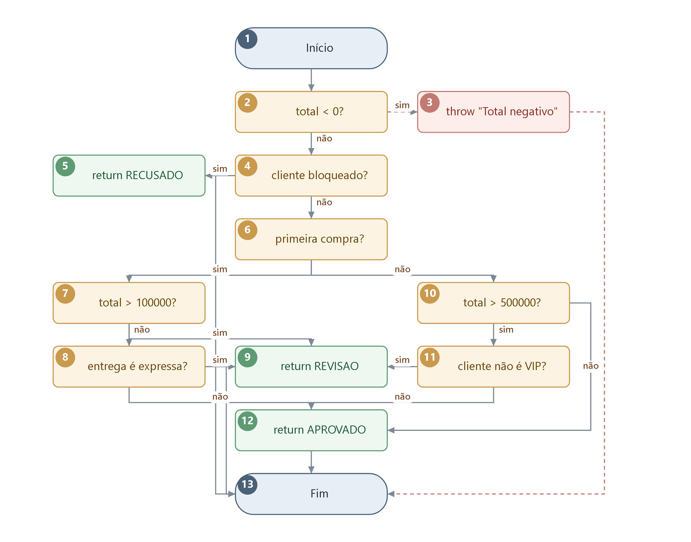
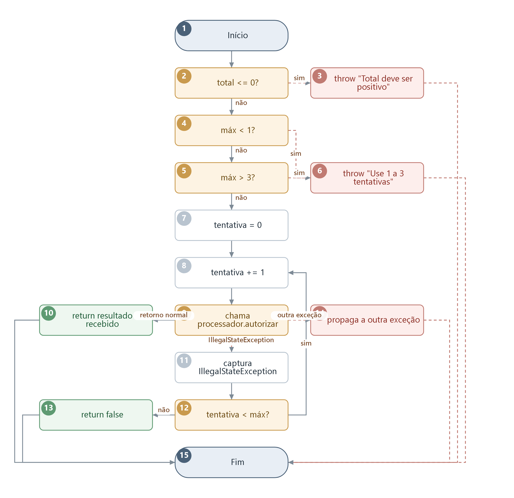
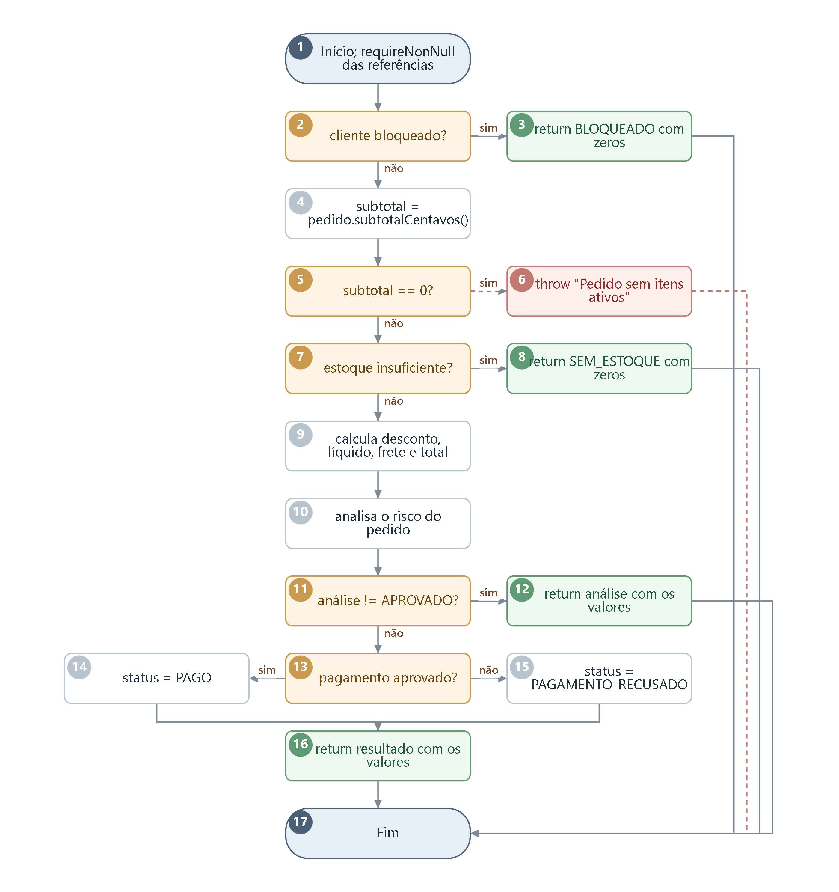

# Relatório do grupo

Integrantes:

- **Pedro Massaki Carnelossi** — RA 24036481-2
- **André Filipe Caetano Mulati** — RA 24011149-2

**Resultado da suíte:** 205 execuções JUnit, nenhuma falha, nenhum erro, nenhum teste ignorado.
**Cobertura final (JaCoCo):** instruções 637/637, linhas 108/108, branches 116/116, métodos 21/21, classes 9/9 — todos em 100%.

**Ambiente:** Windows 11, OpenJDK Temurin 21.0.11, Maven 3.9.12, alvo Java 17, JUnit 5.11.4, JaCoCo 0.8.13.
**Reprodução:** `mvn clean test` nesta pasta; o relatório fica em `target/site/jacoco/index.html`. O `pom.xml` também traz uma regra `jacoco:check` na fase `verify`, exigindo 100% de linhas e branches, de modo que `mvn clean verify` falha caso a cobertura regrida.

Nenhuma regra de produção foi alterada de forma permanente. As duas únicas alterações foram as mutações propositais descritas na seção de análise crítica, ambas desfeitas e conferidas por comparação de arquivo.

---

## Grafos e complexidade

### Relacionamento entre classes

`ProcessadorPagamento` é a única dependência externa do domínio. Nos testes ela é substituída por um dublê
(`ProcessadorSimulado`), o que permite roteirizar aprovação, recusa, indisponibilidade temporária e falha
fora do contrato, além de contar as chamadas e conferir o valor cobrado.

### Grafo de chamadas de `fechar`

A numeração das arestas é a ordem do contrato. Ela importa para os testes: um cliente bloqueado responde
`BLOQUEADO` antes mesmo de somar o pedido, e a falta de estoque é detectada antes de o cupom ser
validado. Os cenários de "saída antecipada" combinam dois problemas de propósito (por exemplo, cliente
bloqueado **com** cupom inválido) justamente para fixar qual verificação prevalece.

### Modelo adotado para curto-circuito, exceções e switch

- Um nó de entrada e **uma única saída unificada**. Todo `return` e todo `throw` desemboca nesse nó final.
- **Cada instrução `throw` do código é um nó distinto.** `PoliticaDesconto` e `PagamentoService` têm duas
  instruções `throw` com mensagens diferentes; tratá-las como um nó só esconderia qual delas o teste
  alcançou.
- **Cada operando de curto-circuito (`&&`, `||`) é um nó de decisão próprio**, já que cada um pode ser
  sozinho a causa do desvio.
- No `switch` do frete, PR, SP, RJ e o `default` são **quatro alternativas**. SP e RJ compartilham o mesmo
  bloco no bytecode, mas foram desenhados como rótulos distintos para registrar os dados de cada um.
  É essa escolha que faz V(G) = 11 contra `Cxty` = 10 do JaCoCo.
- Na chamada ao processador de pagamento há **três saídas**: retorno normal, `IllegalStateException`
  tratada e outra exceção propagada. As duas arestas excepcionais (tracejadas nos desenhos) explicam
  V(G) = 7 contra `Cxty` = 5, porque o JaCoCo não conta `try/catch` como branch.
- Fórmula sempre `V(G) = E − N + 2`. Em um nó com *k* saídas a contribuição é *k* − 1, e não 1 como em uma
  decisão binária.

### Tabela de complexidade

| Método | Nós | Arestas | V(G) | Caminhos independentes | Restrições de viabilidade |
| --- | --- | --- | --- | --- | --- |
| `PoliticaDesconto.calcular` | 23 | 33 | 12 | 12 (C1–C12) | Cupom nulo ou branco retorna antes do `switch` e, portanto, antes do teto. O teto só corta o desconto quando há cupom somado a desconto de base. `Cxty` do JaCoCo: 12. |
| `CalculadoraFrete.calcular` | 22 | 31 | 11 | 11 (C1–C11) | Gratuidade e entrega expressa são mutuamente exclusivas: quando o frete é zerado, a entrega é necessariamente normal. `Cxty` do JaCoCo: 10 (SP e RJ separados no desenho). |
| `AnaliseRisco.avaliar` | 13 | 19 | 8 | 8 (C1–C8) | Cliente novo e cliente com histórico seguem subárvores que nunca se cruzam. Entrega expressa só é consultada na primeira compra; VIP, só no histórico antigo. `Cxty` do JaCoCo: 8. |
| `PagamentoService.pagar` | 15 | 20 | 7 | 7 (C1–C7) | O limite de tentativas é sempre 1 a 3. Somente a falha temporária reentra no laço; recusa definitiva encerra na primeira chamada. `Cxty` do JaCoCo: 5. |
| `PedidoService.fechar` | 17 | 21 | 6 | 6 (C1–C6) | `RECUSADO` do risco é inalcançável por este método: o cliente bloqueado devolve `BLOQUEADO` antes. Alcançável apenas no teste unitário de `AnaliseRisco`. `Cxty` do JaCoCo: 6. |

A base de caminhos não é única: qualquer conjunto de V(G) caminhos independentes serve. A que escolhemos
parte do caminho de sucesso mais comum e acrescenta, a cada linha, **pelo menos uma aresta ainda não
percorrida** — o que garante a independência sem precisar de álgebra sobre vetores de incidência. Todos os
caminhos são viáveis com dados reais e estão reproduzidos, um a um, em `BaseDeCaminhosTest`.

---

### `PoliticaDesconto.calcular` — N = 23, E = 33, V(G) = 12

| Caminho | Sequência de nós | Entradas | Resultado esperado |
| --- | --- | --- | --- |
| C1 | 1-2-4-6-8-9-11-23 | subtotal 0; comum; 1 compra; sem cupom | 0 |
| C2 | 1-2-4-5-9-11-23 | subtotal 10000; VIP; sem cupom | 1000 |
| C3 | 1-2-4-6-7-9-11-23 | subtotal 50000; comum; sem cupom | 2500 |
| C4 | 1-2-4-6-8-9-10-11-23 | subtotal 0; comum; cupom `"   "` | 0 |
| C5 | 1-2-4-6-8-9-10-12-13-14-15-19-20-22-23 | subtotal 10000; comum; 0 compras; `BEMVINDO` | 2000 |
| C6 | 1-2-4-6-8-9-10-12-13-14-19-20-22-23 | subtotal 9999; comum; 0 compras; `BEMVINDO` | 0 |
| C7 | 1-2-4-6-8-9-10-12-13-19-20-22-23 | subtotal 10000; comum; 1 compra; `BEMVINDO` | 0 |
| C8 | 1-2-4-6-8-9-10-12-16-17-19-20-22-23 | subtotal 20000; comum; `EXTRA10` | 2000 |
| C9 | 1-2-4-6-8-9-10-12-16-19-20-22-23 | subtotal 19999; comum; `EXTRA10` | 0 |
| C10 | 1-2-4-6-8-9-10-12-18-23 | subtotal 10000; cupom `"CUPOM-X"` | `IllegalArgumentException` |
| C11 | 1-2-4-5-9-10-12-13-14-15-19-20-21-23 | subtotal 10000; VIP; 0 compras; `BEMVINDO` | 2000 (cortado pelo teto) |
| C12 | 1-2-3-23 | subtotal −1 | `IllegalArgumentException` |

---

### `CalculadoraFrete.calcular` — N = 22, E = 31, V(G) = 11

| Caminho | Sequência de nós | Entradas | Resultado esperado |
| --- | --- | --- | --- |
| C1 | 1-2-4-5-9-10-12-15-17-19-21-22 | PR; 2000 g; líquido 29999; normal; comum; sem frágil | 1200 |
| C2 | 1-2-4-6-9-10-12-15-17-19-21-22 | SP; demais campos iguais ao C1 | 2000 |
| C3 | 1-2-4-7-9-10-12-15-17-19-21-22 | RJ; demais campos iguais ao C1 | 2000 |
| C4 | 1-2-4-8-9-10-12-15-17-19-21-22 | MG; demais campos iguais ao C1 | 3000 |
| C5 | 1-2-4-5-9-10-11-10-12-15-17-19-21-22 | PR; 2001 g (uma repetição do laço) | 1500 |
| C6 | 1-2-4-5-9-10-12-15-16-17-19-21-22 | PR; 2000 g; líquido 100; cliente VIP | 600 |
| C7 | 1-2-4-5-9-10-12-15-17-18-19-21-22 | PR; 2000 g; líquido 100; entrega expressa | 2700 |
| C8 | 1-2-4-5-9-10-12-15-17-19-20-21-22 | PR; 2000 g; líquido 100; item frágil | 1700 |
| C9 | 1-2-4-5-9-10-12-13-14-15-17-19-21-22 | PR; 2000 g; líquido 30000; entrega normal | 0 |
| C10 | 1-2-4-5-9-10-12-13-15-17-18-19-21-22 | PR; 2000 g; líquido 30000; entrega expressa | 2700 |
| C11 | 1-2-3-22 | líquido −1 | `IllegalArgumentException` |

---

### `AnaliseRisco.avaliar` — N = 13, E = 19, V(G) = 8

| Caminho | Sequência de nós | Entradas | Resultado esperado |
| --- | --- | --- | --- |
| C1 | 1-2-4-6-7-8-12-13 | total 0; 0 compras; entrega normal | `APROVADO` |
| C2 | 1-2-4-6-7-9-13 | total 100001; 0 compras; entrega normal | `REVISAO` |
| C3 | 1-2-4-6-7-8-9-13 | total 0; 0 compras; entrega expressa | `REVISAO` |
| C4 | 1-2-4-6-10-12-13 | total 0; 1 compra | `APROVADO` |
| C5 | 1-2-4-6-10-11-9-13 | total 500001; 1 compra; não VIP | `REVISAO` |
| C6 | 1-2-4-6-10-11-12-13 | total 500001; 1 compra; VIP | `APROVADO` |
| C7 | 1-2-4-5-13 | cliente bloqueado | `RECUSADO` |
| C8 | 1-2-3-13 | total −1 | `IllegalArgumentException` |

---

### `PagamentoService.pagar` — N = 15, E = 20, V(G) = 7

| Caminho | Sequência de nós | Entradas | Resultado esperado |
| --- | --- | --- | --- |
| C1 | 1-2-4-5-7-8-9-10-15 | total 100; máx 3; dublê aprova | `true`; 1 chamada |
| C2 | 1-2-4-5-7-8-9-11-12-13-15 | total 100; máx 1; dublê indisponível | `false`; 1 chamada |
| C3 | 1-2-4-5-7-8-9-11-12-8-9-10-15 | total 100; máx 2; indisponível e depois aprova | `true`; 2 chamadas |
| C4 | 1-2-4-5-7-8-9-14-15 | total 100; máx 3; `UnsupportedOperationException` | propaga; 1 chamada |
| C5 | 1-2-3-15 | total 0 | `IllegalArgumentException` |
| C6 | 1-2-4-6-15 | total 100; máx 0 | `IllegalArgumentException` |
| C7 | 1-2-4-5-6-15 | total 100; máx 4 | `IllegalArgumentException` |

---

### `PedidoService.fechar` — N = 17, E = 21, V(G) = 6

| Caminho | Sequência de nós | Entradas | Resultado esperado |
| --- | --- | --- | --- |
| C1 | 1-2-4-5-7-9-10-11-13-14-16-17 | comum; item 10000; PR; normal; dublê aprova | `PAGO` — 10000, 0, 1200, 11200; 1 cobrança |
| C2 | 1-2-4-5-7-9-10-11-13-15-16-17 | mesmos dados; dublê recusa | `PAGAMENTO_RECUSADO` — mesmos valores; 1 cobrança |
| C3 | 1-2-4-5-7-9-10-11-12-17 | 0 compras; item 10000; PR; entrega expressa | `REVISAO` — 10000, 0, 2700, 12700; 0 cobranças |
| C4 | 1-2-4-5-7-8-17 | item 10000 com estoque 0 | `SEM_ESTOQUE` — zeros; 0 cobranças |
| C5 | 1-2-4-5-6-17 | lista de itens vazia | `IllegalArgumentException`; 0 cobranças |
| C6 | 1-2-3-17 | cliente bloqueado | `BLOQUEADO` — zeros; 0 cobranças |

---

## Matriz de testes

Valores monetários em centavos. Os testes parametrizados representam várias execuções; as tabelas
literais dentro de cada arquivo trazem cada entrada e cada valor esperado.

| ID / método JUnit | Unidade | Entrada e estado do stub | Resultado esperado | Caminho / aresta | Critério atendido |
| --- | --- | --- | --- | --- | --- |
| `ClienteTest.deveAceitarHistoricoNaoNegativo` | `Cliente` | histórico 0, 1 e 500 | registro criado; getters corretos | ramo falso de `comprasAnteriores < 0` | validação do registro |
| `ClienteTest.deveRecusarHistoricoNegativo` | `Cliente` | histórico −1 | `IllegalArgumentException` | ramo verdadeiro da mesma decisão | valor-limite inferior |
| `ItemPedidoTest.deveRecusarSkuAusenteOuEmBranco` | `ItemPedido` | SKU nulo, vazio, espaço e tabulação | `IllegalArgumentException` | os dois operandos de `sku == null \|\| isBlank()` | curto-circuito `\|\|` |
| `ItemPedidoTest.deveRecusarPrecoForaDaFaixa` | `ItemPedido` | preço 0, −1 e 1000001 | `IllegalArgumentException` | limite inferior e superior, isolados | valor-limite |
| `ItemPedidoTest.deveRecusarQuantidadeForaDaFaixa` | `ItemPedido` | quantidade −1 e 101 | `IllegalArgumentException` | idem | valor-limite |
| `ItemPedidoTest.deveRecusarEstoqueNegativo` | `ItemPedido` | estoque −1 | `IllegalArgumentException` | decisão simples | validação |
| `ItemPedidoTest.deveRecusarPesoForaDaFaixa` | `ItemPedido` | peso 0, −1 e 100001 | `IllegalArgumentException` | limite inferior e superior, isolados | valor-limite |
| `ItemPedidoTest.deveAceitarOsMenoresValores` / `...MaioresValores` | `ItemPedido` | mínimos e máximos de preço, quantidade e peso | totais 0 e 100000000 | ramo falso de todas as validações | fronteiras válidas |
| `ItemPedidoTest.deveCompararQuantidadeComEstoque` | `ItemPedido` | quantidade abaixo, igual e acima do estoque | `true`, `true`, `false` | os dois ramos de `disponivel` | valor-limite |
| `PedidoTest.deveRecusarListaNula` / `...ItemNuloNaLista` | `Pedido` | lista nula; lista com elemento nulo | `IllegalArgumentException`; `NullPointerException` | operando esquerdo de `itens == null \|\| size > 100` | curto-circuito e `List.copyOf` |
| `PedidoTest.deveLimitarAQuantidadeDeLinhas` | `Pedido` | 100 e 101 linhas | aceita; `IllegalArgumentException` | operando direito da mesma decisão | valor-limite |
| `PedidoTest.deveRecusarUfForaDoPadrao` / `...ParDeLetrasMaiusculas` | `Pedido` | nula, `""`, `pr`, `P`, `PRR`, `1R`, `P1`, `P R`; `PR/SP/RJ/ZZ/AA` | exceção; UF preservada | os dois operandos de `uf == null \|\| !matches` | formato e `default` válido |
| `PedidoTest.deveGuardarCopiaImutavel` | `Pedido` | altera a lista original e a retornada | pedido preservado; `UnsupportedOperationException` | — | contrato de imutabilidade |
| `PedidoTest.deveResponderComOsValoresNeutros` | `Pedido` | lista vazia | subtotal 0; peso 0; frágil `false`; estoque `true` | laço com **zero** repetições | cobertura de laço |
| `PedidoTest.deveIgnorarLinhasInativasNoSubtotal` / `...TodasAsUnidades` | `Pedido` | linha inativa + duas ativas (1 e 2 unidades) | subtotal 300; peso 3000 | `continue`; laço com **várias** repetições | `for` e `continue` |
| `PedidoTest.deveAcusarItemFragilAtivo` / `...FragilInativo` / `...SemItemFragil` | `Pedido` | frágil ativo; frágil inativo; nenhum frágil | `true`; `false`; `false` | os dois operandos de `quantidade > 0 && fragil` | curto-circuito `&&` |
| `PedidoTest.deveInterromperNaPrimeiraLinha` / `...UltimaLinha` / `...EstoqueSuficiente` | `Pedido` | falta de estoque na 1ª linha; na última; em nenhuma | `false`; `false`; `true` | `break` em posições distintas | cobertura de laço |
| `PedidoTest.deveSuportarOMaiorPedidoPossivel` | `Pedido` | 100 linhas × 100 unidades no máximo | subtotal 10000000000; peso 1000000000 | — | limites agregados e tipos numéricos |
| `PoliticaDescontoTest.deveAplicarARegraDoCliente` | `PoliticaDesconto` | VIP e comum; 0 / 49999 / 50000 / 50001 / 101 | 0, 0, 2500, 2500, 10 | nós 4-5-6-7-8 | valor-limite e truncamento |
| `PoliticaDescontoTest.deveIgnorarCupomAusenteOuEmBranco` | `PoliticaDesconto` | cupom nulo, `""`, `" "`, `"   "` | desconto de base | nós 9-10-11 (C1 e C4) | curto-circuito `\|\|` do cupom |
| `PoliticaDescontoTest.deveExigirPrimeiraCompraEValorMinimo` | `PoliticaDesconto` | compras 0/1 × subtotal 9999/10000/10001 | 0, 2000, 2000, 0 | nós 13-14-15 (C5, C6, C7) | curto-circuito `&&` do `BEMVINDO` |
| `PoliticaDescontoTest.deveNormalizarEspacosEMaiusculas` | `PoliticaDesconto` | `bemvindo`, `  BemVindo  `, com tabulação | 2000 | nó 12 | `trim` + maiúsculas |
| `PoliticaDescontoTest.deveExigirValorMinimo` | `PoliticaDesconto` | 19999 / 20000 / 20001 / 50000 com `EXTRA10` | 0, 2000, 2000, 7500 | nós 16-17 (C8, C9) | valor-limite |
| `PoliticaDescontoTest.deveCortarNoTeto` / `...IgualAoTeto` / `...AbaixoDoTeto` | `PoliticaDesconto` | 3000 vs teto 2000; 4000 vs 4000; 2500 vs 10000 | 2000; 4000; 2500 | nós 20-21-22 (C11) | os dois ramos de `desconto > teto` |
| `PoliticaDescontoTest.deveRecusarSubtotalNegativo` / `...CupomDesconhecido` | `PoliticaDesconto` | −1; `NENHUM`, `EXTRA20`, `BEM VINDO`, `X` | `IllegalArgumentException` | nós 3 e 18 (C12 e C10) | os dois `throw`, separados |
| `CalculadoraFreteTest.deveCobrarATarifaDaRegiao` | `CalculadoraFrete` | PR, SP, RJ, MG, ZZ | 1200, 2000, 2000, 3000, 3000 | nós 5-6-7-8 (C1–C4) | `switch` e `default` |
| `CalculadoraFreteTest.deveCobrarTrezentosPorQuiloIniciado` | `CalculadoraFrete` | 1, 1999, 2000, 2001, 3000, 3001, 5000 g | 1200 … 2100 | nós 10-11 (C5) | `while` com zero, uma e várias iterações; kg exato e fração |
| `CalculadoraFreteTest.deveIsentarPedidoAltoEmEntregaNormal` / `...UmCentavoAbaixo` / `...ExpressaAcimaDoLimite` | `CalculadoraFrete` | líquido 29999 / 30000 com normal e com expressa | 1200; 0; 2700 | nós 12-13-14 (C9, C10) | curto-circuito `&&` da gratuidade |
| `CalculadoraFreteTest.deveDividirATarifaDoVip` / `...EntregaExpressa` / `...Fragilidade` | `CalculadoraFrete` | VIP; expressa; frágil, isolados | 600; 2700; 1700 | nós 15-16, 17-18, 19-20 (C6, C7, C8) | decisões independentes |
| `CalculadoraFreteTest.deveCobrarAFragilidadeUmaVezSo` | `CalculadoraFrete` | dois itens frágeis | 1700 | aresta 19→20 percorrida uma vez | adicional único |
| `CalculadoraFreteTest.deveEncadearOsTresAjustes` / `...SobreFreteGratuito` / `...VipComFreteGratuito` | `CalculadoraFrete` | VIP + expressa + frágil; líquido 30001 com frágil; VIP com gratuidade | 2600; 500; 0 | combinações dos nós 15 a 20 | **combinações** além dos ramos |
| `CalculadoraFreteTest.deveRecusarValorLiquidoNegativo` | `CalculadoraFrete` | líquido −1 e −30000 | `IllegalArgumentException` | nó 3 (C11) | validação |
| `AnaliseRiscoTest.deveRecusarAntesDeQualquerOutraRegra` / `...AteMesmoOVip` | `AnaliseRisco` | bloqueado, com e sem VIP | `RECUSADO` | nó 5 (C7) | retorno antecipado |
| `AnaliseRiscoTest.deveAvaliarValorEEntrega` | `AnaliseRisco` | 0 / 99999 / 100000 / 100001 × entrega normal e expressa | `APROVADO` / `REVISAO` | nós 7-8-9 (C1, C2, C3) | curto-circuito `\|\|`; valor-limite |
| `AnaliseRiscoTest.deveRevisarVipNaPrimeiraCompra` | `AnaliseRisco` | VIP com 0 compras e total 100001 | `REVISAO` | nó 7 | VIP não se aplica ao cliente novo |
| `AnaliseRiscoTest.deveAvaliarValorECondicaoVip` | `AnaliseRisco` | 499999 / 500000 / 500001 × VIP e não VIP | `APROVADO` / `REVISAO` | nós 10-11 (C4, C5, C6) | curto-circuito `&&`; valor-limite |
| `AnaliseRiscoTest.deveIgnorarEntregaExpressaNoClienteAntigo` | `AnaliseRisco` | 5 compras, total baixo, entrega expressa | `APROVADO` | aresta 6→10 | subárvore sem consulta a `expresso` |
| `AnaliseRiscoTest.deveRecusarTotalNegativo` | `AnaliseRisco` | total −1 com cliente bloqueado | `IllegalArgumentException` | nó 3 (C8) | precedência da validação |
| `PagamentoServiceTest.deveAprovarNaPrimeiraChamada` | `PagamentoService` | dublê aprova | `true`; 1 chamada de 11200 | nós 9-10 (C1) | retorno imediato |
| `PagamentoServiceTest.deveEncerrarNaRecusaDefinitiva` | `PagamentoService` | dublê recusa | `false`; 1 chamada | mesma aresta, valor `false` | recusa não reentra no laço |
| `PagamentoServiceTest.deveRepetirAteAAprovacao` | `PagamentoService` | aprova na 1ª, 2ª e 3ª tentativa | `true`; 1, 2 e 3 chamadas | aresta 12→8 (C3) | reentrada do `do/while` |
| `PagamentoServiceTest.deveDesistirAoEsgotarOLimite` | `PagamentoService` | sempre indisponível; máx 1, 2 e 3 | `false`; chamadas = limite | nós 12-13 (C2) | término do laço |
| `PagamentoServiceTest.deveEncerrarQuandoARepeticaoTerminaEmRecusa` | `PagamentoService` | indisponível e depois recusa | `false`; 2 chamadas | reentrada seguida de retorno normal | combinação de desfechos |
| `PagamentoServiceTest.deveReapresentarOMesmoValor` | `PagamentoService` | indisponível ×2 e aprova | mesmo total nas 3 chamadas | — | estado entre chamadas |
| `PagamentoServiceTest.devePropagarOutrasExcecoes` | `PagamentoService` | `UnsupportedOperationException` | mesma exceção; 1 chamada | nó 14 (C4) | **exceção fora do contador de branches** |
| `PagamentoServiceTest.deveExigirProcessador` / `...TotalPositivo` / `...LimiteEntreUmETres` | `PagamentoService` | processador nulo; total 0 e −1; máx −1, 0 e 4 | `NullPointerException`; `IllegalArgumentException`; **0 chamadas** | nós 3 e 6 (C5, C6, C7) | guardas anteriores ao laço |
| `PedidoServiceTest.deveFecharOPedidoSimples` | `PedidoService` | comum; item 10000; PR; normal; aprova | `PAGO` 10000/0/1200/11200; 1 cobrança | C1 | caminho completo de sucesso |
| `PedidoServiceTest.deveCombinarDescontoEFrete` | `PedidoService` | VIP; 35000; `EXTRA10`; expressa | `PAGO` 35000/7000/2100/30100; 1 cobrança | C1 com colaboradores ativos | colaboração desconto + frete |
| `PedidoServiceTest.deveRegistrarPagamentoRecusado` | `PedidoService` | mesmos dados; dublê recusa | `PAGAMENTO_RECUSADO`; mesmos valores | C2 | ramo falso de `pagamento aprovado?` |
| `PedidoServiceTest.deveInsistirAteAAprovacao` / `...TresTentativas` | `PedidoService` | indisponível ×2 e aprova; sempre indisponível | `PAGO`; `PAGAMENTO_RECUSADO`; 3 chamadas | C1 e C2 através do serviço interno | repetição delegada |
| `PedidoServiceTest.devePropagarFalhaGrave` | `PedidoService` | `UnsupportedOperationException` | propaga | aresta excepcional | colaboração excepcional |
| `PedidoServiceTest.deveInterromperNoClienteBloqueado` | `PedidoService` | bloqueado **+ lista vazia + cupom inválido** | `BLOQUEADO`; zeros; **0 chamadas** | C6 | precedência sobre subtotal e cupom |
| `PedidoServiceTest.deveRecusarPedidoSemItensAtivos` | `PedidoService` | lista vazia; só linha inativa | `IllegalArgumentException`; 0 chamadas | C5 | subtotal zero |
| `PedidoServiceTest.deveInterromperNoEstoque` | `PedidoService` | estoque 0 **+ cupom inválido** | `SEM_ESTOQUE`; zeros; 0 chamadas | C4 | estoque antes do cupom |
| `PedidoServiceTest.deveInterromperNoCupomDesconhecido` | `PedidoService` | estoque válido + cupom inválido | `IllegalArgumentException`; 0 chamadas | interrupção antes do pagamento | ordem do contrato |
| `PedidoServiceTest.deveInterromperNaAnaliseDeRisco` | `PedidoService` | 0 compras; expressa | `REVISAO` 10000/0/2700/12700; 0 chamadas | C3 | risco pendente não cobra |
| `PedidoServiceTest.deveExigirAsTresReferencias` | `PedidoService` | processador, pedido e cliente nulos | `NullPointerException` | nó 1 | contrato de referências |
| `PedidoServiceTest.devePreservarOsCamposDoResultado` | `ResultadoPedido` | status e quatro valores | getters iguais à construção | — | registro de saída |
| `BaseDeCaminhosTest.descontoCaminho01–12` | `PoliticaDesconto` | dados da tabela de C1 a C12 | valores e exceções literais | C1–C12 | base de caminhos independentes |
| `BaseDeCaminhosTest.freteCaminho01–11` | `CalculadoraFrete` | dados da tabela de C1 a C11 | valores e exceções literais | C1–C11 | base, incluindo os rótulos SP e RJ |
| `BaseDeCaminhosTest.riscoCaminho01–08` | `AnaliseRisco` | dados da tabela de C1 a C8 | classificação ou exceção | C1–C8 | base completa |
| `BaseDeCaminhosTest.pagamentoCaminho01–07` | `PagamentoService` | dados da tabela de C1 a C7 | retorno e contagem de chamadas | C1–C7 | base, com as arestas excepcionais |
| `BaseDeCaminhosTest.fechamentoCaminho01–06` | `PedidoService` | dados da tabela de C1 a C6 | `ResultadoPedido` completo e contagem | C1–C6 | base do serviço |

### Execuções por arquivo

| Arquivo | Unidade coberta | Execuções |
| --- | --- | --- |
| `BaseDeCaminhosTest` | base de caminhos dos cinco grafos | 44 |
| `PoliticaDescontoTest` | `PoliticaDesconto` | 32 |
| `PedidoTest` | `Pedido` | 28 |
| `CalculadoraFreteTest` | `CalculadoraFrete` | 24 |
| `ItemPedidoTest` | `ItemPedido` | 24 |
| `AnaliseRiscoTest` | `AnaliseRisco` | 18 |
| `PagamentoServiceTest` | `PagamentoService` | 17 |
| `PedidoServiceTest` | `PedidoService` e `ResultadoPedido` | 13 |
| `ClienteTest` | `Cliente` | 5 |
| **Total** | | **205** |

Dois arquivos de apoio acompanham a suíte e não são coletados pelo Surefire, por não terminarem em
`Test`: `ApoioDePedidos` (fábricas de objetos) e `ProcessadorSimulado` (o dublê do processador de
pagamento, que recebe um roteiro de desfechos e registra as cobranças).

---

## Evolução da cobertura

| Etapa | Testes executados | Linhas | Branches | Métodos | Classes | Lacunas e justificativas |
| --- | --- | --- | --- | --- | --- | --- |
| Inicial — arquivos como recebidos | 1 (apenas o exemplo de `PedidoServiceTest`) | 87/108 (80,56%) | 50/116 (43,10%) | 20/21 (95,24%) | 9/9 (100,00%) | 66 dos 116 branches descobertos. Nenhuma validação, nenhum cupom, nenhum limite de frete ou de risco e nenhuma repetição do pagamento haviam sido exercitados. |
| + unidades de domínio (`ClienteTest`, `ItemPedidoTest`, `PedidoTest`) | 57 | 37/108 (34,26%) | 46/116 (39,66%) | 9/21 (42,86%) | 3/9 (33,33%) | Fecha as validações de construção, os laços de `Pedido` (zero/uma/várias linhas, `continue`, `break` no início e no fim) e a cópia defensiva. As classes de serviço ainda não são tocadas — por isso os totais caem em relação à linha anterior, que executava o serviço inteiro. |
| + regras de cálculo (`PoliticaDescontoTest`, `CalculadoraFreteTest`, `AnaliseRiscoTest`) | 131 | 74/108 (68,52%) | 98/116 (84,48%) | 15/21 (71,43%) | 6/9 (66,67%) | Fecha `switch`, `while`, teto do desconto e os curto-circuitos de cupom e de risco, sempre com o limite e os dois vizinhos. Faltam pagamento e fechamento. |
| + pagamento e serviço (`PagamentoServiceTest`, `PedidoServiceTest`) | 161 | **108/108 (100%)** | **116/116 (100%)** | **21/21 (100%)** | **9/9 (100%)** | Fecha o `do/while`, os três desfechos da chamada externa e as quatro saídas antecipadas do fechamento. **A cobertura chega a 100% aqui.** |
| **Final — com `BaseDeCaminhosTest`** | **205** | **108/108 (100%)** | **116/116 (100%)** | **21/21 (100%)** | **9/9 (100%)** | **Nenhuma lacuna.** Instruções: 637/637 (100%). Os 44 testes da base de caminhos **não elevam nenhum percentual** — eles documentam que a base dos grafos é executável com dados reais. É a prova, dentro da própria suíte, de que cobertura e caminhos são critérios distintos. |

Duas leituras desta tabela merecem registro.

A segunda linha **piora** todos os percentuais em relação à primeira, e isso não é um erro: o exemplo
inicial atravessa `PedidoService` inteiro e, de passagem, executa uma linha de quase toda classe, enquanto
os testes de domínio exercitam três classes a fundo e não tocam nas demais. Percentual alto de classe ou
de linha pode significar apenas "passou por aqui".

A quarta linha já marca 100% em todos os contadores, e ainda assim a suíte cresceu de 161 para 205 testes.
Os 44 testes acrescentados depois são a base de caminhos independentes — que, por definição, o JaCoCo não
sabe medir.

O estado inicial ilustra por que os indicadores não valem o mesmo. Com **um único teste**, as nove classes
já apareciam como 100% cobertas e os métodos marcavam 95,24%, enquanto **57% dos branches nunca haviam sido
executados**. Classe e método medem apenas se algo foi chamado; branch é o primeiro indicador que exige
variar os dados de entrada.

---

## Análise crítica

### Quais combinações faltavam mesmo com os ramos cobertos?

No frete, testar um cenário com tudo falso e outro com VIP, expressa e frágil verdadeiros já cobre 100%
dos ramos — e ainda assim nunca combina **frete gratuito com item frágil**. Essa combinação importa porque
a gratuidade zera a base e o adicional de peso, mas *não* o adicional de fragilidade. O teste
`deveCobrarFragilidadeSobreFreteGratuito` (líquido 30001, entrega normal, item frágil, esperado 500) existe
só para fixar isso; ele não aumenta a cobertura em um único ponto percentual.

O mesmo vale para `Participacao` no projeto irmão: `(true,true)` e `(false,false)` cobrem todos os ramos,
mas deixam sem execução justamente os dois casos em que um único benefício é somado — onde uma troca entre
2 e 1 ponto passaria despercebida.

### Quais condições não foram avaliadas devido ao curto-circuito?

- `cupom == null || cupom.isBlank()` — com cupom nulo, `isBlank()` **nunca é avaliado**.
- `comprasAnteriores == 0 && subtotal >= 10_000` — com histórico diferente de zero, o valor mínimo do
  `BEMVINDO` **não é consultado**.
- `total > 100_000 || expresso` — cliente novo com total acima de 100000 **não consulta** a entrega
  expressa.
- `total > 500_000 && !cliente.vip()` — cliente antigo com total até 500000 **não consulta** a condição de
  VIP.
- `liquido >= 30_000 && !pedido.expresso()` — líquido abaixo de 30000 **não consulta** o tipo de entrega.
- `sku == null || sku.isBlank()` e `itens == null || itens.size() > 100` — mesmo padrão.

Em todos os casos os testes variam as causas **separadamente**, de modo que cada operando seja, em algum
cenário, o único responsável pelo desvio.

### Quais caminhos são inviáveis no serviço, mas viáveis na unidade?

O mais claro é `RECUSADO` de `AnaliseRisco`. Ele é alcançável no teste unitário (caminho C7 do grafo de
risco), mas **nunca** através de `PedidoService.fechar`: o serviço devolve `BLOQUEADO` no nó 3, antes de
chegar à análise. Testar as duas situações mostra a diferença entre o que a unidade permite e o que a
colaboração permite.

Há também combinações inviáveis dentro de um mesmo grafo: cliente novo e cliente com histórico não
coexistem na mesma avaliação de risco; e, no frete, quando a gratuidade se aplica, a entrega é
necessariamente normal, logo não existe caminho com gratuidade e entrega expressa ao mesmo tempo. A base de
caminhos usa apenas entradas viáveis, e nenhuma regra de produção foi alterada para forçar um caminho.

### Como foram testadas exceções e quantidades de iterações?

**Exceções.** Os três desfechos da chamada ao processador foram verificados por resultado *e* por contagem
de chamadas, porque o JaCoCo não conta arestas de `try/catch` como branch: retorno `false` encerra com 1
chamada; `IllegalStateException` reentra no laço; `UnsupportedOperationException` sobe inalterada
(`assertSame` no objeto original) com 1 chamada. É exatamente a diferença entre V(G) = 7 no nosso modelo e
`Cxty` = 5 no relatório do JaCoCo.

**Iterações.** `Pedido` é exercitado com zero, uma e várias linhas, com linha inativa acionando `continue`
e com falta de estoque no início e no fim acionando `break`. O `while` do peso cobre zero, uma e três
repetições, incluindo quilo exato (3000 g) e fração (2001 g e 3001 g). O `do/while` do pagamento cobre de
uma a três tentativas, além dos limites inválidos 0, −1 e 4.

### Qual alteração proposital foi detectada por qual teste? A alteração foi desfeita?

Foram feitas **duas** alterações, uma de cada vez, e **ambas foram desfeitas**. Em cada caso o arquivo foi
restaurado a partir de uma cópia feita antes da alteração e conferido por comparação; a suíte voltou a 205
execuções aprovadas.

| Mutação | Alteração aplicada | Resultado da suíte | Detectada por |
| --- | --- | --- | --- |
| **A — fronteira** | `AnaliseRisco`: `total > 500_000` passa a `total >= 500_000` | 205 execuções, **1 falha** | `AnaliseRiscoTest.deveAvaliarValorECondicaoVip[2]` — esperava `APROVADO` e obteve `REVISAO` para o total de exatamente 500000 |
| **B — constante** | `PoliticaDesconto`: teto de `subtotal * 20 / 100` passa a `* 25 / 100` | 205 execuções, **2 falhas** | `PoliticaDescontoTest.deveCortarNoTeto` e `BaseDeCaminhosTest.descontoCaminho11` — esperavam 2000 e obtiveram 2500 |

A mutação A é a mais reveladora. Ela desloca uma fronteira em **um único centavo** e, de 205 execuções,
apenas **uma** percebeu a diferença: exatamente o caso que usa o valor-limite 500000. Todos os outros
testes de risco continuaram passando. É a demonstração prática de por que o valor-limite é testado
explicitamente e não substituído por um valor "no meio da faixa" — e também de que 100% de cobertura não
implica capacidade de detecção: a suíte já estava em 100% de linhas e branches *antes* da mutação, e teria
continuado em 100% mesmo se aquele único teste usasse 490000 em vez de 500000.

### Limitações

Cobertura de 100% não prova ausência de defeitos, não mede cobertura de caminhos completos e não garante
MC/DC. Os oráculos são literais calculados a partir do enunciado — nenhum teste chama a implementação sob
teste para produzir o próprio valor esperado (por exemplo, 35000 − 7000 + (1200 / 2 + 1500) = 30100). Ainda
assim, o espaço de valores monetários possíveis é muito maior do que a suíte, e laços multiplicam caminhos
além do que uma base de caminhos básicos consegue enumerar.
